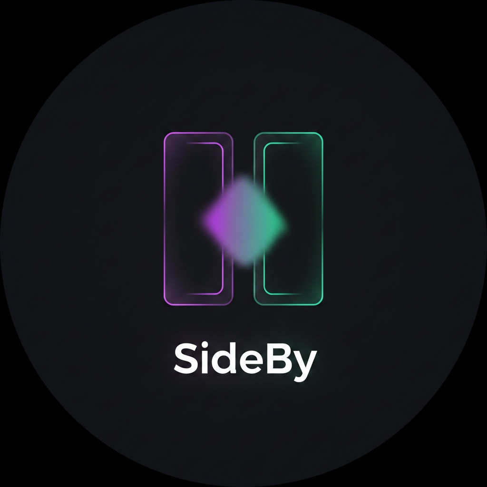

<p align="center">
  
</p>

<h1 align="center">SideBy</h1>

<p align="center">
  <strong>Research Faster. Compare Smarter.</strong>
</p>

---

## What is SideBy?

SideBy is an AI-powered research and comparison platform operated by SnapSolve Ink. It helps users analyze options, synthesize web signals, and make clearer decisions.

The current repository is transitioning from a single comparison experience into a broader SaaS product built around:

- AI comparison
- source-backed web research
- private beta accounts
- refreshable comparison records
- public comparison URLs
- premium UI and motion

## Current Stack

| Layer | Technologies |
|-------|-------------|
| Frontend | React, TypeScript, Vite, Tailwind CSS, shadcn/ui, Framer Motion |
| API | Vercel Serverless Functions plus Spring Boot service in transition |
| Database | Neon Postgres |
| Auth | Clerk |
| Deployment | Vercel |
| Research Extraction | Firecrawl when configured, fetch fallback otherwise |

## Private Beta

The current beta is deployed on Vercel and uses marketplace-provisioned Neon and Clerk resources.

- Beta URL: https://sideby-kappa.vercel.app
- Neon schema: [neon/migrations/001_sideby_private_beta.sql](./neon/migrations/001_sideby_private_beta.sql)
- Vercel API functions: [frontend/api](./frontend/api)

## Local Development

```bash
# Frontend
cd frontend
pnpm install
pnpm run dev

# Vercel serverless parity
npx vercel dev
```

The legacy Spring Boot backend still exists while the product migrates to the Vercel beta architecture.

## Docker

1. Copy `.env.docker.example` to `.env`
2. Fill in your database and provider keys
3. Start everything:

```bash
docker compose up --build
```

The app will be available at:

- Frontend: `http://localhost:5173`
- Backend: `http://localhost:8080`

Notes:

- The frontend container serves the built app with Nginx.
- Nginx proxies `/api/*` to the backend container, so the default Docker frontend API base URL is `http://localhost:5173`.
- Neon remains your external hosted dependency; it is not containerized here.

## Environment

Frontend expects:

- `VITE_API_BASE_URL` (leave empty on Vercel for same-origin functions)
- `VITE_CLERK_PUBLISHABLE_KEY` or `NEXT_PUBLIC_CLERK_PUBLISHABLE_KEY`
- `VITE_PEXELS_API_KEY` (optional)

Serverless API expects:

- `DATABASE_URL` or `POSTGRES_URL`
- `CLERK_SECRET_KEY`
- `FIRECRAWL_API_KEY` (optional but recommended for clean extraction)

Spring Boot backend expects:

- `FIRECRAWL_API_KEY` (optional)
- `SERVER_PORT` (optional)

## Product Direction

The product roadmap for the full SideBy SaaS is documented in:

- [SNAPSOLVE_MASTER_PLAN.md](./SNAPSOLVE_MASTER_PLAN.md)

## Domain

- https://snapsolve.ink

---

<p align="center">
  <a href="https://snapsolve.ink"><strong>Made by SnapSolve Ink</strong></a>
</p>
